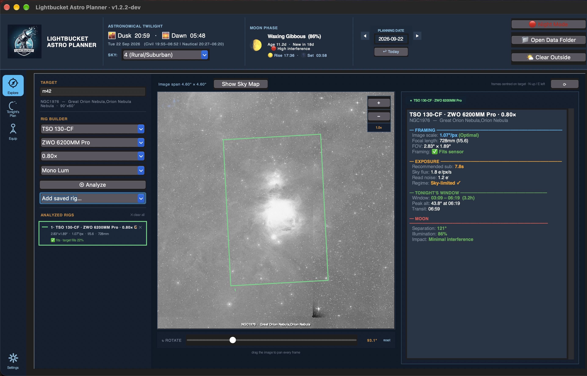
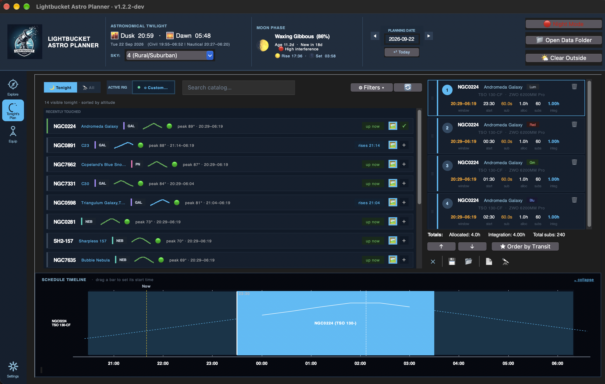
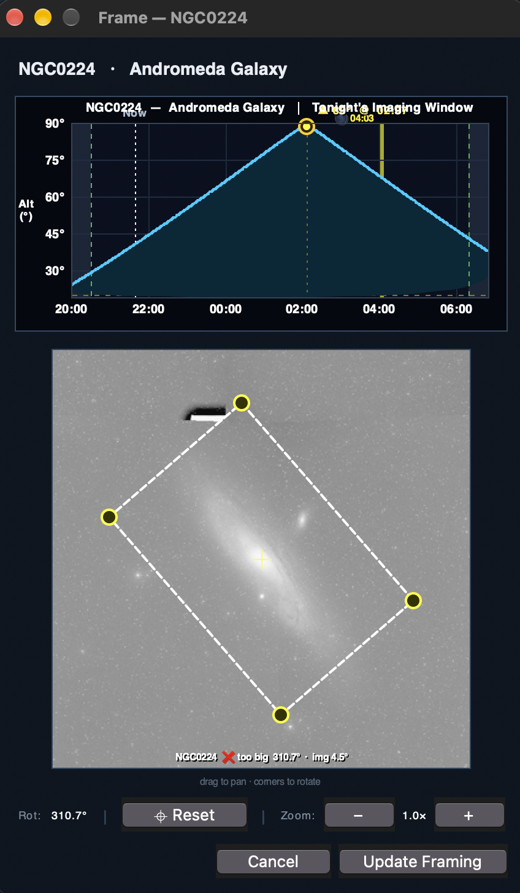
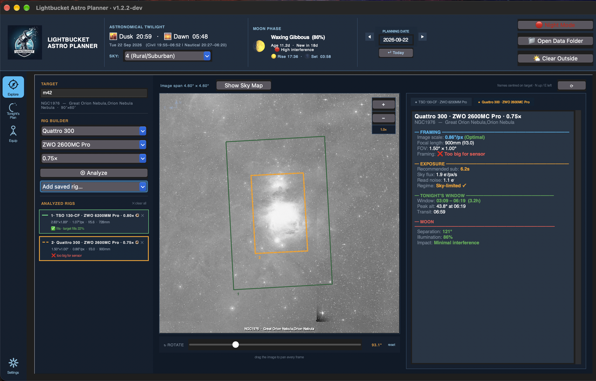

# Lightbucket Astro Planner

### Plan tonight's deep-sky imaging session in five minutes — and hand the list straight to NINA.

**[⬇ Download for macOS](https://github.com/LightbucketAstro/lightbucket-astro-planner/releases/latest)** &nbsp;·&nbsp; **[⬇ Download for Windows](https://github.com/LightbucketAstro/lightbucket-astro-planner/releases/latest)** &nbsp;·&nbsp; [Documentation](#first-run-setup) &nbsp;·&nbsp; [Report a bug](https://github.com/LightbucketAstro/lightbucket-astro-planner/issues/new)

---

## What it does

Lightbucket is a free, local desktop app that closes the gap between **"what should I image tonight?"** and **"NINA, run this list."** Built for amateur deep-sky astrophotographers who already use [N.I.N.A.](https://nighttime-imaging.eu/) to drive their rigs, but great for anyone who wants to plan their evening of astrophotography.

In one window it:

- 🔭 **Searches NGC, IC, Messier, Caldwell, and Sharpless** from one box, with auto-complete on common names ("Orion Nebula" → M42 → NGC 1976) and a per-catalog filter to narrow suggestions to just the lists you care about
- 🎯 **Frames the target on your sensor** with a draggable, rotatable FOV overlay on a live DSS image, in a dedicated Frame dialog — and your final framing carries through to the export, so if you nudge the frame off-centre or rotate it, NINA centres and rotates to match
- 🗺️ **Opens an interactive sky map** centred on your target — a wide-field view with constellations, the Milky Way, a coordinate grid, and your sensor frame drawn in, as the zoomed-out companion to the close-up DSS framing
- 🧭 **Compares rigs on a target** on the Explore tab — overlay up to six colour-coded scope/camera/reducer sensor frames on one DSS image, with a legend showing each rig's FOV, image scale, and how well the target fills the frame; apply a saved preset from your Rig Library in one click
- ⏱️ **Recommends a sub-exposure length** from your camera's read noise and your Bortle-class sky background — with read-noise vs sky-flux regime detection so you know *why*
- 🌙 **Calculates tonight's imaging window** between astronomical twilight, moonrise/moonset, and per-target altitude
- 📍 **Saves named location profiles** so dark-site travelers can switch between home and remote sites in a click — every twilight, moon, and altitude calculation follows the active site
- 📊 **Schedules the night as a drag-to-reorder plan** — commit targets straight from a live "what's up tonight" grid, reorder them by dragging a card's grip handle, and see the whole night as a collapsible timeline strip
- 🚀 **Exports a `.ninaTargetSet` file** you double-click into NINA's Sequencer — multi-rig plans split automatically into one file per telescope
- 📄 **Exports a printable plan** as a plain-text summary or a self-contained HTML report that embeds each target's altitude chart and prints to PDF straight from your browser
- 🧩 **Imports your NINA profile** — pulls in filter-wheel names (LRGB + narrowband, with a bandwidth prompt) and your configured telescope, showing a preview of exactly what will be added or updated before anything is saved, and never touches whichever filter you currently have selected
- 🛠️ **Saves reusable equipment "rigs" and filter sets** — build a Rig Library of one-click scope + camera + reducer + filter combinations, and a Filter Library of Filter Sets that can mix LRGB and narrowband channels under a single saved filter wheel
- 💾 **Saves and reloads sessions** as JSON, with a prompt on close so an evening's planning is never lost by accident
- 🔴 **Switches between day and night themes** so it's legible outdoors under a red torch and indoors at a desk
- 🌆 **Keeps Bortle class as one control** — change the single header dropdown and every already-planned target's recommended exposure rescales automatically, so a plan never silently goes stale under a different sky

No account, no cloud, no subscription. Your data stays on your machine. Built as a Tkinter desktop app and shipped as native installers — no Python install required on either platform.

## Screenshots

<table>
  <tr>
    <td width="50%">
      
      
<b>Explore</b> — search a target, pick your gear, and see the sensor frame drawn to scale on a live DSS image

    </td>
    <td width="50%">
      
      
<b>Tonight's Plan</b> — browse what's up, frame or one-click add a target, then drag its card into order

    </td>
  </tr>
  <tr>
    <td width="50%">
      
      
<b>Frame dialog</b> — drag to pan, grab a corner to rotate, and confirm to commit the framing to your plan

    </td>
    <td width="50%">
      
      
<b>Visible Tonight</b> — seasonal targets above your altitude floor, filtered by type and magnitude

    </td>
  </tr>
  <tr>
    <td width="50%">
      
      
<b>Explore</b> — stack colour-coded sensor frames from different rigs on one target to pick the best equipment for it

    </td>
    <td width="50%">
      
      
<b>HTML export</b> — a printable night's-plan report with each target's altitude chart, ready for Print → Save as PDF

    </td>
  </tr>
</table>

## Why I built this

I kept finding myself on imaging nights doing the same routine — checking Stellarium for what's up, doing sub-exposure math on a napkin, opening Telescopius to check a frame, then hand-typing it all into NINA's Sequencer. So I built the planner I wanted.

If it's useful to you too, [grab the latest release](https://github.com/LightbucketAstro/lightbucket-astro-planner/releases/latest). If something's broken or missing, [open an issue](https://github.com/LightbucketAstro/lightbucket-astro-planner/issues/new) — I read all of them.

---

## Installation

> **A note on code signing.** The builds are **not currently signed** by
> Apple or Microsoft. Both operating systems will warn you the first time you
> run the app. The steps below show you how to bypass those warnings for an
> unsigned build — this is a one-time action per install.

### macOS

**Requirements:** macOS 11 (Big Sur) or later. Apple Silicon only (Apple Intel support coming in a future release).

1. Download **`LightbucketAstroPlanner-2.0.0.dmg`** from the release page.
2. Open the DMG and drag **Lightbucket Astro Planner** into your
   **Applications** folder.
3. The first time you launch it:
   - Open **Applications** in Finder.
   - **Right-click** (or Ctrl-click) **Lightbucket Astro Planner** and choose
     **Open**.
   - When macOS warns that the app is from an unidentified developer, click
     **Open**.
   - *(Alternatively, if macOS blocks it outright: open* **System Settings →
     Privacy & Security**, *scroll down, and click* **Open Anyway** *next to
     the block notice.)*
4. After the first successful launch, you can open the app normally from
   Launchpad or the Dock.

### Windows

**Requirements:** Windows 10 (1909 or later) or Windows 11, 64-bit.

1. Download **`LightbucketAstroPlanner-2.0.0-setup.exe`** from the
   release page.
2. Run the installer. If **Windows Defender SmartScreen** appears:
   - Click **More info**.
   - Click **Run anyway**.
3. Follow the installer prompts. The app installs to
   `%LOCALAPPDATA%\Programs\LightbucketAstroPlanner` by default and adds a
   Start Menu entry.
4. Launch **Lightbucket Astro Planner** from the Start Menu.

---

## First-Run Setup

When you launch the app for the very first time, it has no idea who you are,
where you are, or what gear you own. A guided first-run flow walks you through
the three things it needs before it can plan anything useful.

### 1. Welcome dialog

A welcome dialog appears explaining that the inventory is empty. Dismiss it to
begin — with nothing in your inventory yet, the app also opens straight on
the **Equip** tab, so there's nowhere else to navigate to first. Behind the
scenes, the app is already geolocating you by IP address so your observer
location is roughly correct by the time you reach the Settings tab.

> **macOS tip:** on first launch, the equipment-entry fields can occasionally
> render blank until the window is clicked. If you see empty fields, click
> once inside the tab to wake them up.

### 2. Add your equipment — *Equip* tab

You must add at least:

- **One camera** (pixel size, resolution, read noise, gain — values are
  usually in the manufacturer's data sheet).
- **One telescope** (aperture and focal length — the app computes the
  focal ratio from these).

Optionally, add **reducers / flatteners** and **filters**. These can be
assigned per-target when you plan.

Once you've added a camera and telescope, consider saving them together —
plus a reducer and a filter set — as a named preset in the **Rig Library**
underneath the inventory. That turns four dropdown selections into one click
every time you switch gear later.

### 3. Verify your location — *Settings* tab

Open the **Settings** tab. The **Observer Location** card shows the latitude
and longitude detected from your IP address. If these are off — IP
geolocation sometimes lands on your ISP rather than your home — edit them
manually and click **Save**, or click **📍 Auto-detect** to try again.

Accurate coordinates matter for twilight times, moon altitude, and the
per-target imaging window, so it's worth getting right.

If you observe from more than one place, save each as a **named location
profile**: get the coordinates right, then use the **Location** dropdown's
**☆ Save** to name the site (your first one is created automatically as
*Home*). Switch sites anytime from that dropdown — or from the Visible
Tonight dialog — and use **⚙ Manage** to rename, update, or delete them.
Auto-detect fills the fields and leaves saving to you, so detecting a new
spot never overwrites a saved site.

### 4. (Optional) Import your NINA profile — *Settings* tab

In the **Data Management** card, click **Import NINA Profile** and point the
dialog at your NINA `.profile` file. On Windows the picker opens in
`%LOCALAPPDATA%\NINA\profiles` by default.

The importer reads three things:

- **Filter-wheel names**, sorted into LRGB and narrowband. If narrowband
  filters are found, you'll be asked for their **bandwidth in nm** — this
  sharpens the sub-exposure recommendation, since narrower filters suppress
  sky background more.
- **Your telescope** (name, focal length, f-ratio; aperture is derived).
  It's added to — or updated in — your Equip inventory.

Before anything is saved, a preview lists every item with a **NEW**,
**UPDATE**, or **EXISTS** badge so you can confirm exactly what will change.
The import only ever merges filter names into your Filter Library — it never
changes whichever filter you currently have selected, even if the bandwidth
prompt is answered for a different one. Imported filter names are also
written into the NINA export so exported targets slot straight into your
filter wheel.

### 5. (Optional) Tune your analysis preferences — *Settings* tab

The **Analysis Preferences** card exposes:

| Setting                              | Default             | What it does                                                                  |
| ------------------------------------ | ------------------- | ----------------------------------------------------------------------------- |
| **C-constant (sub-exposure factor)** | `10`                | Multiplier in the recommended-sub-length formula. Higher = longer subs.       |
| **Default Bortle class**             | `4 (Rural/Suburban)`| Sets the Bortle class the header's SKY control starts on.                     |
| **Default allocated hours**          | `4.0`               | How many hours the integration planner targets per object. `0` = use full dark window. |
| **Min altitude for Visible Tonight** | `20°`               | Targets below this altitude during the dark window are hidden from "Visible Tonight" lists. |
| **Auto-update analysis on equipment change** | Off          | When on, changing a piece of equipment immediately re-runs the analysis.      |

Click **Save Preferences** to persist. The NGC / IC catalog downloads
automatically in the background on first launch; if the download fails, the
app falls back to a built-in catalog of all 110 Messier objects and you can
retry from **Data Management → Re-download**.

### 6. (Optional) Decide about update checking — *Settings* tab

The app is distributed only through GitHub Releases, so it has no installer
that can update itself. Instead, the **Updates** card checks GitHub once a day
for a newer release and tells you if one exists.

| Setting                          | Default | What it does                                                            |
| --------------------------------- | ------- | ----------------------------------------------------------------------- |
| **Check for updates on launch** | On      | Contacts GitHub at most once every 24 hours to compare release versions. |

Nothing is ever downloaded or installed automatically. When a newer version is
found, a dismissible strip appears under the header — **What's new** opens the
release notes, **Download** opens the release page in your browser. You stay in
control of when (and whether) to install.

The check is a single request to GitHub's public releases API. It sends no
personal data and no telemetry; the app version travels in the request's
User-Agent string, as it does for the catalog and image downloads. If you'd
rather it made no network calls at launch, untick the box — the change saves
immediately, no **Save Preferences** click needed.

If you're offline, the check fails silently and the app carries on normally.
**Check now** runs an immediate check and reports what it finds, including
"you're up to date."

You are now ready to plan a session. The app opens on the **Explore** tab —
search a target there to compare it across your gear — or switch straight to
**Tonight's Plan** and search there (try **M42**, **NGC 7000**, or
**IC 1318**) to jump into framing and add it to tonight's list.

---

## Using the App

The app opens on **Explore**, and a compact icon sidebar switches between
four workspaces: **Explore**, **Tonight's Plan**, **Equip**, and
**Settings**. A header strip stays visible across all of them, showing
tonight's twilight window, the moon, a single **Bortle-class** control, and
the active equipment "rig" chip.

### 🧭 Explore

Explore is where you evaluate a target against your gear before committing to
it — search, frame, and compare, all in one canvas.

Type a target name into the search box — auto-complete works against the
NGC / IC catalog and the bundled common-name map (Orion Nebula → M42 → NGC
1976) — and use the **▽ catalog filter** to limit suggestions to any
combination of NGC, IC, Messier, Caldwell, Sharpless, or Other, each shown
with its live object count. The button gains a dot (▽•) whenever a catalog
is switched off, and your choice is remembered between sessions.

Below the search box, the **Rig Builder** lets you pick a scope, camera, and
(optionally) a reducer and filter, then press **⊕ Analyze**. The rig's
sensor frame is drawn to true angular scale over a DSS image of the target,
centred at position angle 0°. Press Analyze again with different equipment
and each combination stacks up as another colour-coded frame (solid, dashed,
and dotted outlines double as a colour-blind-safe distinguisher), up to six
rigs side by side. If you've saved a preset in the Rig Library, **Add saved
rig…** applies and analyzes it in a single click.

Each analyzed rig gets a **legend card** in the left rail showing its FOV,
image scale, focal ratio and effective focal length, plus whether the target
fits the sensor and how much of the frame it fills — the number that usually
settles the "which rig?" question. Hover a card to highlight its frame and
dim the others; use the 👁 toggle to hide a frame without losing its colour,
✕ to remove it, or **✕ clear all** to start over.

The image is fetched at whatever span your largest analyzed FOV needs — there's
no fixed size cap, so a wide-FOV rig frames correctly instead of clipping at
the edge. A span wide enough to take a while server-side shows an explicit
"Fetching wide field…" status with an elapsed timer, rather than substituting
a small placeholder image that could be mistaken for the final result; a
**Show 5° field instead** option is there if you'd rather not wait. Switching
targets keeps your whole rig stack and re-frames it over the new object, so
you can sweep one set of equipment across a season's worth of candidates.
Offline, the tab falls back to a geometric ellipse preview, with the frames
still drawn to scale.

The **Show Sky Map** button opens a wide-field, interactive sky map centred
on the analyzed target. It shows stars, constellation lines and names,
Messier objects, the Milky Way band, and a coordinate grid (each toggleable),
with a magnitude slider, zoom control, and an approximate field-of-view
readout. Your sensor frame is drawn on the target at the right size and
position angle, a **Recenter** button snaps back after you pan, and the map
follows the app's day/night theme. Analyze a target first — the button needs
coordinates to centre on.

The map renders fully offline from assets bundled with the app and opens in
its own window. On Windows that window uses the Microsoft Edge WebView2
runtime, which ships with essentially all current Windows 10 / 11 systems; if
it isn't available, the map falls back to opening in your default browser, so
the button never dead-ends. macOS uses the built-in system web view — nothing
extra to install.

Explore doesn't add anything to tonight's plan on its own. Once you know
which rig you want, switch to **Tonight's Plan** to frame and commit it.

### 🌙 Tonight's Plan

This is where a night actually gets built: a live browsing grid on the left,
your committed plan on the right, and a collapsible schedule timeline across
the bottom.

**The browsing grid** shows what's visible tonight by default; the 🌙
**Tonight** / 🔭 **All** toggle drops the altitude gate so you can browse — or
search for — any catalog object regardless of whether it clears the horizon
right now. Its own search box works the same way as Explore's, and
submitting it (or picking a suggestion) jumps straight into framing that
target, whether or not it's in the visible-tonight list. Each card shows a
colour-coded object-type chip, a small altitude sparkline, a moon-condition
icon, a capped "peak ##° · HH:MM–HH:MM" readout, and a **visibility pill**
("up now" / "rises HH:MM" / "—").

Two icons on each card handle adding it to your plan. **🖼 Frame** opens the
**Frame dialog** — an altitude/moon chart above a draggable, rotatable
sensor-frame preview on a live DSS image. Drag to pan the frame off-centre,
grab a corner to rotate it; the rotation readout shows the position angle in
NINA's own convention (counter-clockwise from north, 0° upright), so the
number on the preview matches NINA's framing assistant. **Confirm Framing**
(relabeled **Update Framing** if the target's already in your plan under this
exact rig and filter) commits that exact centre and rotation to the export.
**＋ Add to Tonight** skips the dialog entirely, adding the target
immediately at its catalog coordinates with no rotation — useful when you
don't need to fine-tune the framing.

The equipment **rig chip** in the toolbar opens a slide-in **Equipment
drawer** — scope, reducer, camera, and filter dropdowns, plus a **Manage
Rigs** button — so you can swap gear without leaving the tab. Whatever's
selected there is what the next **Frame** or **Add to Tonight** action uses.

**The plan itself** is a rail of cards on the right, each with a rig-coloured
accent bar, target name and filter badge, an equipment line, and a two-row
metrics grid (window / start / sub-exposure / allocated hours / sub count /
total integration). Drag a card's **⠿ grip handle** to reorder it — the
existing ↑ / ↓ / ★ **Order by Transit** controls are all still there too — or
click 🗑 to remove it.

At the bottom, a collapsible **Schedule Timeline** strip shows the whole
night as a Gantt-style chart you can drag to reschedule.

- **Export Session** — saves the night's plan as a readable report. Pick the
  format in the Save dialog's file-type list: a plain-text summary you can
  paste into a notes app, or a self-contained HTML page that embeds each
  target's altitude chart and prints straight to PDF from any browser
  (**Print → Save as PDF**).
- **Export to NINA** — writes a `.ninaTargetSet` file you can open directly
  in NINA's Sequencer. If your plan spans multiple telescopes, the app
  detects this and writes one file per scope into a folder you choose. Each
  target carries J2000 coordinates — the framed centre if you moved the FOV
  box, otherwise the catalog position — the FOV rotation as NINA's position
  angle, and your filter names (LRGB, narrowband, and mono luminance) so
  sequences drop in already framed and matched to your filter wheel.

Plans are saved as JSON session files in a `sessions` subfolder. When you
close the app with entries still in the plan, you're prompted to save first.

### 🔭 Equip

Equipment inventory, plus two library panels for reusable presets:

- **Camera / Telescope / Reducer inventory** — add, edit, and delete the
  individual pieces of gear that populate every equipment dropdown in the
  app.
- **Rig Library** — save a scope + camera + reducer + filter-set combination
  as a named preset (`+` add, `✎` edit, `✕` delete). Double-click a rig in
  the list to apply it to the active equipment chips instantly. This is the
  same underlying data the toolbar's **Manage Rigs** dialog edits.
- **Filter Library** — manage **Filter Sets** rather than individual
  filters: a set is what's actually loaded in your filter wheel, and it can
  mix LRGB and narrowband channels. Adding or editing a narrowband set fills
  in Hα / S2 / O3 slots plus a single **shared bandwidth** for the whole set
  — narrower filters suppress sky background more, which sharpens the
  sub-exposure recommendation. A mixed set fans "Add to Tonight" out into one
  plan row per filter, each with its own exposure; a pure-LRGB set uses the
  flat broadband factor instead.

### ⚙ Settings

Observer location — including named **location profiles** for multiple
observing sites, with ☆ to save the current coordinates and ⚙ to rename,
update, or delete saved sites — analysis preferences, data management
(NINA profile import, NGC / IC catalog re-download, DSS image cache clear),
sky-map catalog tiers, and **Updates**.

Bortle class isn't set here, or per-rig, anymore — it's the single **SKY:**
control in the header, next to the twilight readout. Changing it immediately
re-runs analysis wherever it matters, including rescaling the exposure time
and sub-count on every target already sitting in tonight's plan, so a plan
built under one sky never silently goes stale under another.

The **Updates** card holds the *Check for updates on launch* toggle and a
**Check now** button that runs an immediate check and reports the result.
See the [First-Run Setup](#first-run-setup) section for details on each field.

---

## Where Your Data Lives

All user data — equipment inventory, preferences, the NGC catalog, and
saved sessions — is kept in a single folder outside the app bundle, so
uninstalling or upgrading the app never touches your library.

| Platform | Location                                              |
| -------- | ----------------------------------------------------- |
| macOS    | `~/LightbucketAstroPlanner/`                          |
| Windows  | `%LOCALAPPDATA%\LightbucketAstroPlanner\`             |

Inside that folder you'll find:

- `astro_gear.json` — equipment, preferences, last session state, and your
  Rig Library and Filter Sets
- `ngc_catalog.csv` — downloaded NGC / IC catalog
- `ngc_addendum.csv` — extra non-NGC/IC objects (downloaded alongside the main catalog)
- `sessions/` — saved `.json` session plans
- `dss_cache/` — cached DSS thumbnails (safe to delete)
- `crash.log` — only present if the app has crashed; useful for bug reports

To fully reset the app, quit it and delete the folder above. It will be
re-created on next launch.

---

## Upgrading From an Earlier Version

Upgrading is safe: install the new build over the top of the old one. All
your data — equipment, sessions, preferences, and catalog — lives outside
the app in your data folder (see [Where Your Data Lives](#where-your-data-lives))
and is never touched by an install.

Two notes on the new catalogs:

- **Sharpless arrives automatically.** It ships inside the app, so it's
  available the first time the new version launches. No action needed.
- **Messier and Caldwell need a one-time catalog refresh.** These are merged
  into the NGC/IC data when the catalog is downloaded, so your existing
  catalog file won't include them yet. Open **Settings → Data Management**
  and click **Re-download** next to *NGC/IC catalog*. This also pulls in a
  few non-NGC/IC objects (e.g. the Double Cluster) and refreshes the Messier
  cross-references.

  > **Do this while connected to the internet.** If the re-download runs
  > offline it falls back to a built-in 110-object Messier list until you
  > retry online.

After the refresh, the status line under *NGC/IC catalog* shows a per-catalog
breakdown (NGC · IC · Messier · Caldwell · Sharpless counts) — a quick way to
confirm everything loaded.

Nothing needs migrating for NINA: any filter names you imported previously
still work. To pick up the new telescope-import and bandwidth features, just
re-run **Import NINA Profile**.

New in 1.1.0, the **Sky Map** needs nothing migrated — it's available as soon
as you've installed the update and analyzed a target. On Windows, if the
embedded window can't start, the map opens in your default browser instead.

New in 1.1.1, nothing needs migrating either:

- **Your location becomes a profile automatically.** On first launch the
  update folds your existing coordinates into a named *Home* profile, so
  nothing changes until you add more sites. Save extra dark-site profiles from
  **Settings → Observer Location**.
- **FOV framing now reaches NINA.** Panning or rotating the framing box on the
  Planner is carried into the `.ninaTargetSet` as the target centre and
  position angle (J2000) — no setup required.
- **Mono filters export correctly.** Filter names for mono LRGB/narrowband
  sequences now match NINA's target-set format, so they slot straight into the
  filter wheel on import. Re-export any older plans to pick this up.
- **Visible Tonight gained a Rise column and sortable headers.** No migration
  needed — open the dialog and click a header to sort.

New in 1.1.2, nothing needs migrating:

- **Plans export to HTML, not just text.** The **Export Session** button now
  offers a self-contained HTML report alongside the plain-text one — choose
  the format from the Save dialog's file-type list. The HTML page embeds a
  per-target altitude chart (dark window, the night's altitude track, moon
  rise/set, and your imaging window) and is styled to print cleanly, so
  **Print → Save as PDF** in any browser produces a PDF with no extra tools.
- **FOV rotation matches NINA.** The framing box's rotation readout now shows
  the sky position angle in NINA's convention — counter-clockwise from north,
  0° with the frame upright — so the number on the preview matches NINA's
  framing assistant, and the same value is written to the `.ninaTargetSet`.
  Earlier builds used an internal screen angle that ran the opposite way; if a
  plan's exact rotation matters, re-export it to pick up the corrected angle.

New in 1.2.0, nothing needs migrating:

- **The Explore tab arrives ready to use.** It reads the cameras, telescopes,
  and saved rig presets you already have — open the new 🧭 sidebar entry,
  search a target, and start stacking sensor frames.
- **A 0.75× reducer joins the reduction dropdown** on both the Planner and
  Explore tabs. Sessions saved with it restore correctly on relaunch.

New in 1.2.1, nothing needs migrating:

- **Minor fix to Explore panel image update routine.** Images now refresh
  correctly when changing to a different object with the same FOV.

New in 1.2.2, nothing needs migrating:

- **The app now tells you when a new version is out.** On launch it checks
  GitHub at most once a day and, if a newer release exists, shows a dismissible
  strip under the header with **What's new** and **Download**. Nothing is
  downloaded or installed automatically — the buttons just open the release
  notes and the release page. Turn the whole thing off under
  **Settings → Updates**, or run a check on demand with **Check now**.

New in 2.0.0:

- **The sidebar is down to four tabs.** **Explore**, **Tonight's Plan**,
  **Equip**, and **Settings** — the old Planner and Targets tabs are
  retired. Searching, framing, and adding a target to your plan now all
  happen on Tonight's Plan; comparing gear on a target happens on Explore,
  which is also the tab the app opens on. See [Using the App](#using-the-app)
  for the full tour of both.
- **Tonight's Plan is now the single hub for building your night.** Its left
  pane is a live, searchable grid of what's visible tonight — toggle 🌙
  Tonight / 🔭 All to browse the whole catalog regardless of altitude — and
  each card shows an altitude sparkline, a moon-condition icon, and a
  visibility pill ("up now" / "rises HH:MM"). Click 🖼 to open the Frame
  dialog, or ＋ to add a target straight to plan with no dialog at all.
- **A dedicated Frame dialog replaces inline framing.** Opening 🖼 on any
  target pops up its altitude/moon chart above a drag-and-rotate FOV
  preview, with **Confirm Framing** (or **Update Framing**, if it's already
  in your plan under this exact rig). Confirming commits the framed centre
  and rotation straight to the plan.
- **An Equipment drawer slides in from the toolbar's rig chip** on Tonight's
  Plan — swap scope, reducer, camera, or filter without losing your place,
  and jump to Manage Rigs from the same panel.
- **Bortle class is now one control, not several.** It lives once, in the
  header, next to the twilight readout — no more separate Bortle dropdowns
  in the equipment drawer or Explore's rig builder. Changing it immediately
  re-runs analysis everywhere it matters, including rescaling the exposure
  time and sub-count on every target already sitting in tonight's plan.
- **Rig Library.** Save a scope + camera + reducer + filter-set combination
  as a named, one-click preset on the Equip tab, or apply one straight from
  Explore's **Add saved rig…** picker.
- **Filter Library and Filter Sets.** Filters are now grouped into named
  Filter Sets instead of managed one at a time, and a set can mix LRGB and
  narrowband channels under one saved filter wheel. Every narrowband member
  of a set shares one bandwidth value, so editing it updates the whole set
  at once. "Add to Tonight" with a mixed set fans out to one plan row per
  member filter, each with its own exposure; a pure-LRGB set uses the flat
  broadband factor instead. **On first launch, your existing filters are
  folded into a starter Filter Set automatically — nothing to re-enter.**
- **Plan cards drag-to-reorder.** Grab a card's ⠿ grip handle to reorder
  tonight's plan directly — the existing ↑ / ↓ / ★ Order by Transit controls
  are all still there too.
- **Wide-field previews no longer clip — or stall.** A rig with a large
  sensor FOV (say, 6° × 4°) used to get its DSS preview clipped at a hard 5°
  cap; that cap is gone. Fetching a genuinely wide field can take a while
  server-side, so instead of guessing or hanging, the preview now shows an
  explicit "Fetching wide field…" status with an elapsed timer, rather than
  silently substituting a small placeholder image that could be mistaken for
  the final result — a **Show 5° field instead** option is there if you'd
  rather not wait. Applies to both the Frame dialog and the Explore tab.
- **Switching gear always shows the right preview now.** Fixed a bug where
  moving from a wide-FOV rig to a narrower one on the same target could
  leave the old, wider image stuck on screen indefinitely — it looked like
  the fetch had hung, but it had actually completed; a stale internal guard
  was refusing to display the new, correct image just because it was
  smaller than the one already showing.
- **Importing a NINA profile no longer touches your active filter.** It
  still merges filter names into your Filter Library and updates your
  telescope, but it no longer silently reassigns whichever filter you
  currently have selected to a leftover bandwidth value from the import.
- **Changing the header's Planning Date now always refreshes what you're
  browsing.** A date change used to update twilight and moon times but leave
  the browsing grid's peak-altitude values stale until something else forced
  a refresh.
- **First run is a little smarter.** If your equipment inventory is empty,
  the app now opens straight on the Equip tab instead of Explore, so
  there's nothing to search or compare against yet.
- **Re-adding a target under a different rig is tracked correctly.**
  Tonight's Plan now recognises "already added" per target *and*
  scope/camera/filter combination, not just by target — so a card correctly
  shows ＋ again if you want to add the same object under a second setup.
- **Tonight's Plan's action toolbar no longer shrinks when the plan is
  empty.** Clearing every target used to squeeze the Export / NINA / reorder
  buttons down to a sliver — icons and labels included — until something was
  added back and the layout recovered.
- **Loading a session now pins its targets to the top of the browsing grid.**
  Previously only manually-added targets got this treatment; targets
  restored from a saved session were left to fall wherever the grid's normal
  sort happened to place them.
- **Framing now survives a session reload properly.** The saved pan and
  rotation were always written correctly to the session file and to NINA
  exports — but re-opening the Frame dialog on an already-framed target
  right after loading a session used to show the preview reset to centred
  and unrotated instead of your saved framing, and clicking **Update
  Framing** from that view would have overwritten the good saved data with
  the reset values. Reopening Frame now restores the saved pan and rotation
  correctly.

Nothing about your saved data needs migrating by hand for any of the above —
sessions, gear, rigs, and filter sets all upgrade automatically the first
time you launch 2.0.0.

---

## Reporting Bugs

If something breaks, please include:

1. Your OS and version.
2. The app version (shown in the title bar, and under **Settings → Updates**).
3. A copy of `crash.log` from the data folder if one exists.
4. A short description of what you were doing when the problem occurred.

---

## Contributing

PRs welcome on small fixes and clear-cut improvements. For anything larger —
new features, architectural changes, refactors — please open an issue first
so we can discuss the approach before code gets written. That saves both of
us time if the change isn't a fit, and helps shape it if it is.

---

## License

Released under the MIT License. See [LICENSE](LICENSE) for the full text.

In short: you may use, copy, modify, and redistribute this software freely,
including in commercial projects, provided the original copyright notice and
license text travel with it. The software is provided as-is, with no warranty.

## Credits

Target catalog derived from the [OpenNGC](https://github.com/mattiaverga/OpenNGC)
project. DSS thumbnails courtesy of the STScI Digitized Sky Survey. NINA
interoperability via the public `.ninaTargetSet` XML schema. Sharpless H II
regions derived from VizieR VII/20. Caldwell cross-references per Patrick
Moore (Sky & Telescope, 1995). Interactive sky map powered by
[d3-celestial](https://github.com/ofrohn/d3-celestial) by Olaf Frohn
(BSD-3-Clause).
