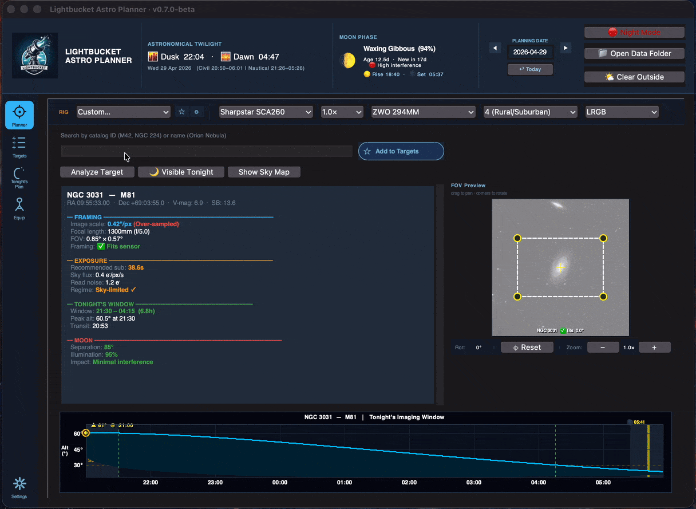
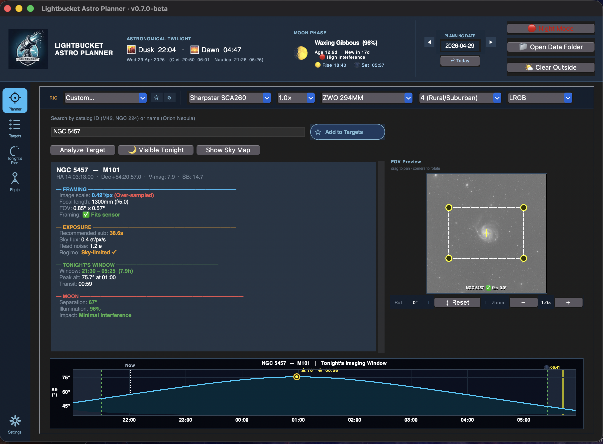
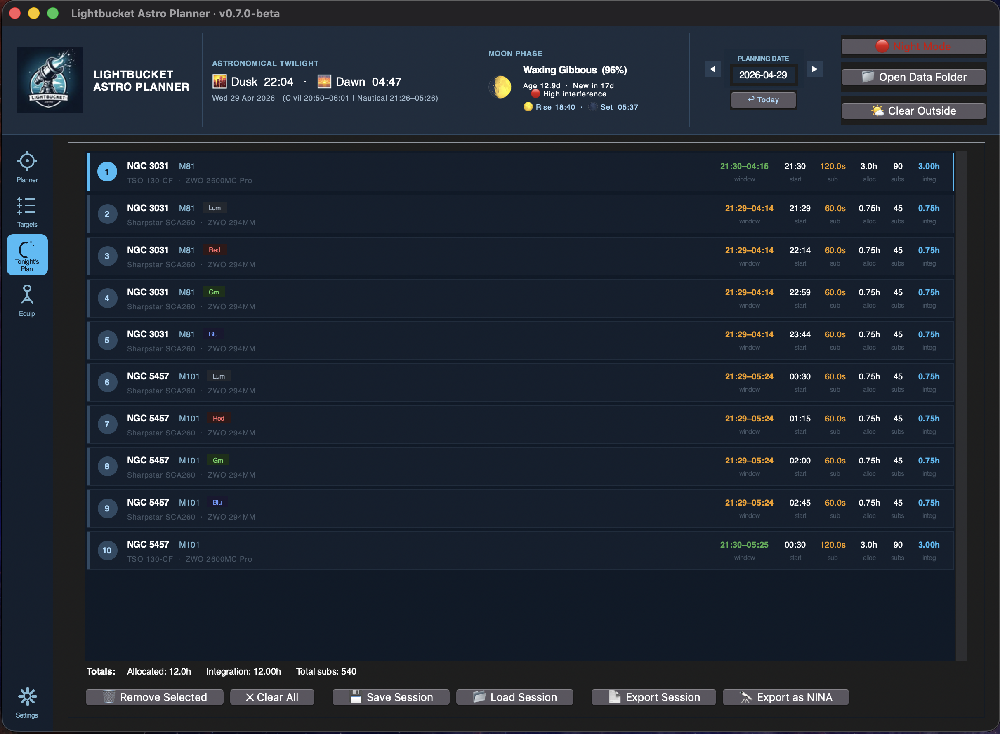
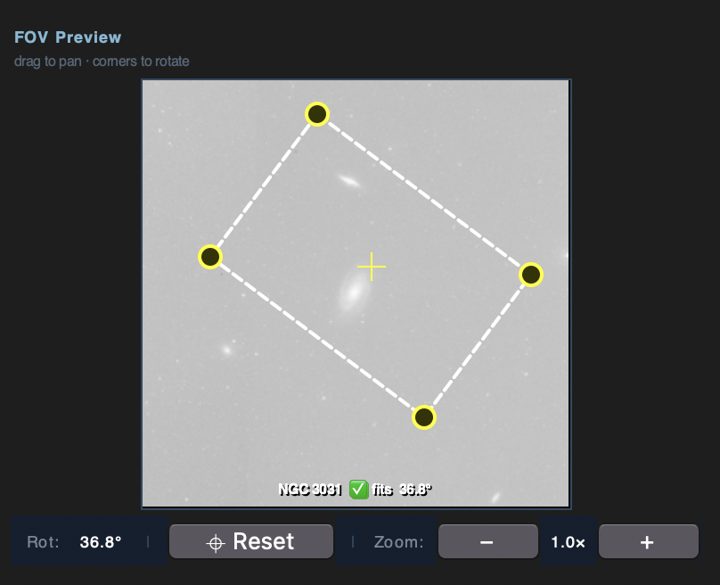
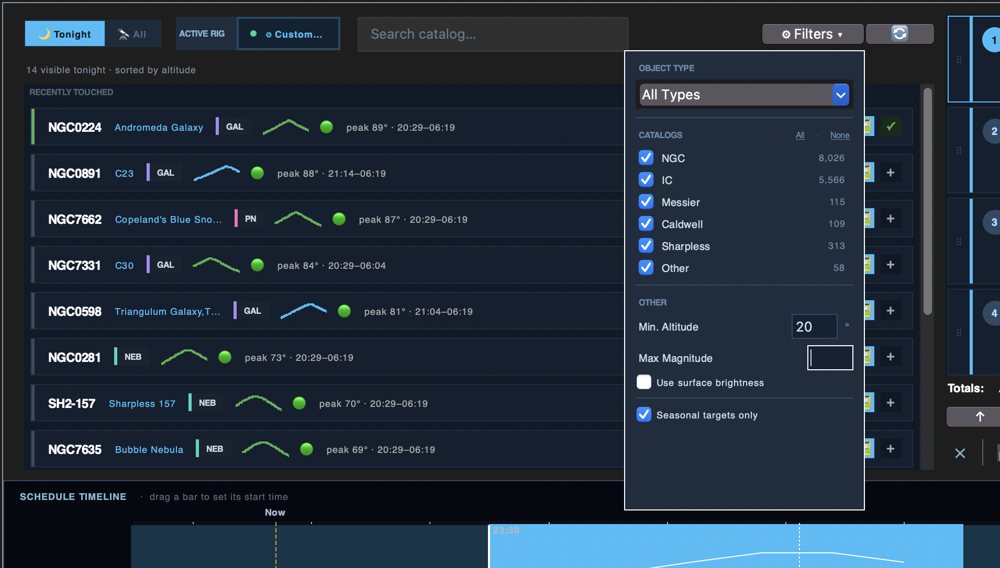

# Lightbucket Astro Planner

### Plan tonight's deep-sky imaging session in five minutes — and hand the list straight to NINA.

**[⬇ Download for macOS](https://github.com/LightbucketAstro/lightbucket-astro-planner/releases/latest)** &nbsp;·&nbsp; **[⬇ Download for Windows](https://github.com/LightbucketAstro/lightbucket-astro-planner/releases/latest)** &nbsp;·&nbsp; [Documentation](#first-run-setup) &nbsp;·&nbsp; [Report a bug](https://github.com/LightbucketAstro/lightbucket-astro-planner/issues/new)

---

## What it does

Lightbucket is a free, local desktop app that closes the gap between **"what should I image tonight?"** and **"NINA, run this list."** Built for amateur deep-sky astrophotographers who already use [N.I.N.A.](https://nighttime-imaging.eu/) to drive their rigs.

In one window it:

- 🔭 **Searches the full NGC / IC catalog** with auto-complete on common names ("Orion Nebula" → M42 → NGC 1976)
- 🎯 **Frames the target on your sensor** with a draggable, rotatable FOV overlay on a live DSS image
- ⏱️ **Recommends a sub-exposure length** from your camera's read noise and your Bortle-class sky background — with read-noise vs sky-flux regime detection so you know *why*
- 🌙 **Calculates tonight's imaging window** between astronomical twilight, moonrise/moonset, and per-target altitude
- 📊 **Builds a multi-target Gantt schedule** for the night, with per-rig support for dual-scope setups
- 🚀 **Exports a `.ninaTargetSet` file** you double-click into NINA's Sequencer — multi-rig plans split automatically into one file per telescope
- 🛠️ **Stores your equipment inventory** — cameras, telescopes, and reducers — so every new session starts with the right gear pre-filled
- 💾 **Saves and reloads sessions** as JSON, with a prompt on close so an evening's planning is never lost by accident
- 🔴 **Switches between day and night themes** so it's legible outdoors under a red torch and indoors at a desk

No account, no cloud, no subscription. Your data stays on your machine. Built as a single-window Tkinter app and shipped as native installers — no Python install required on either platform.

## Screenshots

<table>
  <tr>
    <td width="50%">
      
      
<b>Planner</b> — target analysis with framing, exposure recommendation, and the night's altitude track

    </td>
    <td width="50%">
      
      
<b>Tonight's Plan</b> — multi-rig schedule with one-click NINA export per scope

    </td>
  </tr>
  <tr>
    <td width="50%">
      
      
<b>FOV framing</b> — drag and rotate your sensor frame on a live DSS image

    </td>
    <td width="50%">
      
      
<b>Visible Tonight</b> — seasonal targets above your altitude floor, filtered by type and magnitude

    </td>
  </tr>
</table>

## Why I built this

I kept finding myself on imaging nights doing the same routine — checking Stellarium for what's up, doing sub-exposure math on a napkin, opening Telescopius to check a frame, then hand-typing it all into NINA's Sequencer. So I built the planner I wanted.

If it's useful to you too, [grab the latest release](https://github.com/LightbucketAstro/lightbucket-astro-planner/releases/latest). If something's broken or missing, [open an issue](https://github.com/LightbucketAstro/lightbucket-astro-planner/issues/new) — I read all of them.

---

## Installation

> **A note on code signing.** The builds are **not currently signed** by
> Apple or Microsoft. Both operating systems will warn you the first time you
> run the app. The steps below show you how to bypass those warnings for an
> unsigned build — this is a one-time action per install.

### macOS

**Requirements:** macOS 11 (Big Sur) or later. Apple Silicon and Intel both
supported.

1. Download **`LightbucketAstroPlanner-1.0.0.dmg`** from the release page.
2. Open the DMG and drag **Lightbucket Astro Planner** into your
   **Applications** folder.
3. The first time you launch it:
   - Open **Applications** in Finder.
   - **Right-click** (or Ctrl-click) **Lightbucket Astro Planner** and choose
     **Open**.
   - When macOS warns that the app is from an unidentified developer, click
     **Open**.
   - *(Alternatively, if macOS blocks it outright: open* **System Settings →
     Privacy & Security**, *scroll down, and click* **Open Anyway** *next to
     the block notice.)*
4. After the first successful launch, you can open the app normally from
   Launchpad or the Dock.

### Windows

**Requirements:** Windows 10 (1909 or later) or Windows 11, 64-bit.

1. Download **`LightbucketAstroPlanner-1.0.0-setup.exe`** from the
   release page.
2. Run the installer. If **Windows Defender SmartScreen** appears:
   - Click **More info**.
   - Click **Run anyway**.
3. Follow the installer prompts. The app installs to
   `%LOCALAPPDATA%\Programs\LightbucketAstroPlanner` by default and adds a
   Start Menu entry.
4. Launch **Lightbucket Astro Planner** from the Start Menu.

---

## First-Run Setup

When you launch the app for the very first time, it has no idea who you are,
where you are, or what gear you own. A guided first-run flow walks you through
the three things it needs before it can plan anything useful.

### 1. Welcome dialog

A welcome dialog appears explaining that the inventory is empty. Dismiss it to
begin. Behind the scenes, the app is already geolocating you by IP address so
your observer location is roughly correct by the time you reach the Settings
tab.

> **macOS tip:** on first launch, the equipment-entry fields can occasionally
> render blank until the window is clicked. If you see empty fields, click
> once inside the tab to wake them up.

### 2. Add your equipment — *Equip* tab

Open the **Equip** tab in the sidebar. You must add at least:

- **One camera** (pixel size, resolution, read noise, gain — values are
  usually in the manufacturer's data sheet).
- **One telescope** (aperture and focal length — the app computes the
  focal ratio from these).

Optionally, add **reducers / flatteners** and **filters**. These can be
assigned per-target when you plan.

### 3. Verify your location — *Settings* tab

Open the **Settings** tab. The **Observer Location** card shows the latitude
and longitude detected from your IP address. If these are off — IP
geolocation sometimes lands on your ISP rather than your home — edit them
manually and click **Save**, or click **📍 Auto-detect** to try again.

Accurate coordinates matter for twilight times, moon altitude, and the
per-target imaging window, so it's worth getting right.

### 4. (Optional) Import your NINA filter names — *Settings* tab

In the **Data Management** card, click **Import Filter Names** and point the
dialog at your NINA `.profile` file. On Windows the picker opens in
`%LOCALAPPDATA%\NINA\profiles` by default. Imported filter names are used
throughout the planner and written into the NINA export so the exported
targets slot straight into your filter wheel setup.

### 5. (Optional) Tune your analysis preferences — *Settings* tab

The **Analysis Preferences** card exposes:

| Setting                              | Default             | What it does                                                                  |
| ------------------------------------ | ------------------- | ----------------------------------------------------------------------------- |
| **C-constant (sub-exposure factor)** | `10`                | Multiplier in the recommended-sub-length formula. Higher = longer subs.       |
| **Default Bortle class**             | `4 (Rural/Suburban)`| Sets the Bortle pre-selected on the Planner tab.                              |
| **Default allocated hours**          | `4.0`               | How many hours the integration planner targets per object. `0` = use full dark window. |
| **Min altitude for Visible Tonight** | `20°`               | Targets below this altitude during the dark window are hidden from "Visible Tonight" lists. |
| **Auto-update analysis on change**   | Off                 | When on, changing a dropdown or a filter immediately re-runs the analysis.    |

Click **Save Preferences** to persist. The NGC / IC catalog downloads
automatically in the background on first launch; if the download fails, the
app falls back to a built-in catalog of ~60 well-known targets and you can
retry from **Data Management → Re-download**.

You are now ready to plan a session. Switch to the **Planner** tab and search
for a target — for example, **M42**, **NGC 7000**, or **IC 1318** — to see a
complete analysis.

---

## Using the App

The app is organised as five tabs, selectable from the icon sidebar on the
left.

### 🎯 Planner

The main workspace for analysing a single object. Choose a camera, telescope,
and (optionally) a reducer and filter from the equipment chips at the top.
Pick a Bortle class and type a target name into the search box — the app
auto-completes against the NGC / IC catalog and the bundled common-name map
(Orion Nebula → M42 → NGC 1976).

The right side of the tab shows:

- A **DSS thumbnail** of the target with a draggable, rotatable sensor frame
  that previews exactly how the object will land on your sensor.
- A **text analysis** panel with recommended sub-exposure, moon conditions,
  the night's imaging window for that target, and integration math.
- An **altitude track** showing the target's altitude across the night with
  twilight and moon shading.

When the analysis looks good, click **Add to Plan** to push it onto
**Tonight's Plan**.

### ⭐ Targets

A multi-target queue. Use this to build up a shortlist of candidates — for
example, a night with two or three objects — each with its own equipment,
filter, and allocated-time assignment. Entries can be edited, reordered, or
promoted to the final plan.

### 🌙 Tonight's Plan

The final list for the evening. Shows a per-target summary, a Gantt-style
schedule, and the exports:

- **Export plain text** — a readable night's-plan summary you can paste into
  a notes app or print.
- **Export to NINA** — writes a `.ninaTargetSet` file you can open directly
  in NINA's Sequencer. If your plan spans multiple telescopes, the app
  detects this and writes one file per scope into a folder you choose.

Plans are saved as JSON session files in a `sessions` subfolder. When you
close the app with entries still in the plan, you're prompted to save first.

### 🔭 Equip

Equipment inventory. Add, edit, and delete cameras, telescopes, and reducers.
Values entered here populate the equipment dropdowns throughout the app.

### ⚙ Settings

Observer location, analysis preferences, and data management (NINA filter
import, NGC / IC catalog re-download, DSS image cache clear). See the
[First-Run Setup](#first-run-setup) section for details on each field.

---

## Where Your Data Lives

All user data — equipment inventory, preferences, the NGC catalog, and
saved sessions — is kept in a single folder outside the app bundle, so
uninstalling or upgrading the app never touches your library.

| Platform | Location                                              |
| -------- | ----------------------------------------------------- |
| macOS    | `~/LightbucketAstroPlanner/`                          |
| Windows  | `%LOCALAPPDATA%\LightbucketAstroPlanner\`             |

Inside that folder you'll find:

- `astro_gear.json` — equipment, preferences, last session state
- `ngc_catalog.csv` — downloaded NGC / IC catalog
- `sessions/` — saved `.json` session plans
- `dss_cache/` — cached DSS thumbnails (safe to delete)
- `crash.log` — only present if the app has crashed; useful for bug reports

To fully reset the app, quit it and delete the folder above. It will be
re-created on next launch.

---

## Reporting Bugs

If something breaks, please include:

1. Your OS and version.
2. The app version (shown in the title bar).
3. A copy of `crash.log` from the data folder if one exists.
4. A short description of what you were doing when the problem occurred.

---

## Contributing

PRs welcome on small fixes and clear-cut improvements. For anything larger —
new features, architectural changes, refactors — please open an issue first
so we can discuss the approach before code gets written. That saves both of
us time if the change isn't a fit, and helps shape it if it is.

---

## License

Released under the MIT License. See [LICENSE](LICENSE) for the full text.

In short: you may use, copy, modify, and redistribute this software freely,
including in commercial projects, provided the original copyright notice and
license text travel with it. The software is provided as-is, with no warranty.

## Credits

Target catalog derived from the [OpenNGC](https://github.com/mattiaverga/OpenNGC)
project. DSS thumbnails courtesy of the STScI Digitized Sky Survey. NINA
interoperability via the public `.ninaTargetSet` XML schema.
