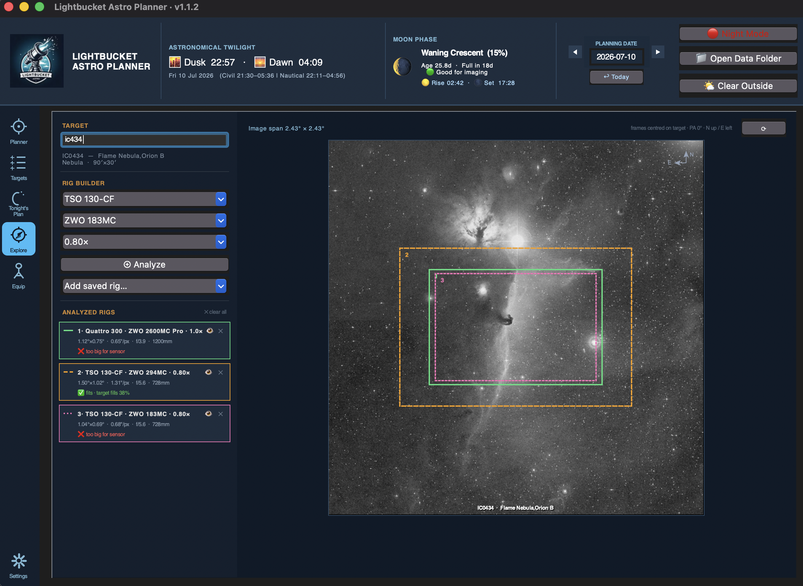
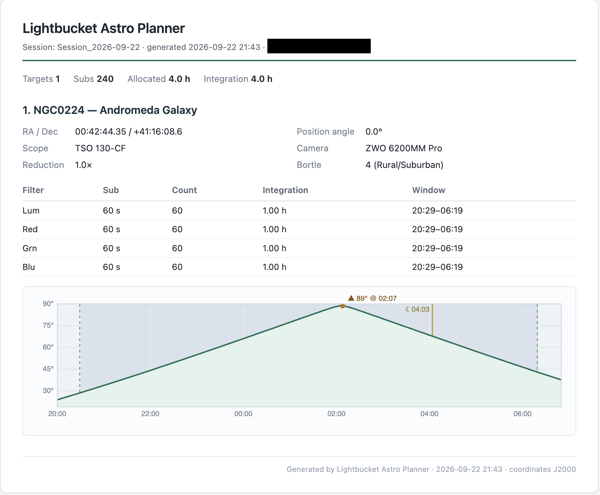

# Lightbucket Astro Planner

### Plan tonight's deep-sky imaging session in five minutes — and hand the list straight to NINA.

**[⬇ Download for macOS](https://github.com/LightbucketAstro/lightbucket-astro-planner/releases/latest)** &nbsp;·&nbsp; **[⬇ Download for Windows](https://github.com/LightbucketAstro/lightbucket-astro-planner/releases/latest)** &nbsp;·&nbsp; [Documentation](#first-run-setup) &nbsp;·&nbsp; [Report a bug](https://github.com/LightbucketAstro/lightbucket-astro-planner/issues/new)

---

## What it does

Lightbucket is a free, local desktop app that closes the gap between **"what should I image tonight?"** and **"NINA, run this list."** Built for amateur deep-sky astrophotographers who already use [N.I.N.A.](https://nighttime-imaging.eu/) to drive their rigs, but great for anyone who wants to plan their evening of astrophotography.

In one window it:

- 🔭 **Searches NGC, IC, Messier, Caldwell, and Sharpless** from one box, with auto-complete on common names ("Orion Nebula" → M42 → NGC 1976) and a per-catalog filter to narrow suggestions to just the lists you care about
- 🎯 **Frames the target on your sensor** with a draggable, rotatable FOV overlay on a live DSS image — and your final framing carries through to the export, so if you nudge the frame off-centre or rotate it, NINA centres and rotates to match
- 🗺️ **Opens an interactive sky map** centred on your target — a wide-field view with constellations, the Milky Way, a coordinate grid, and your sensor frame drawn in, as the zoomed-out companion to the close-up DSS framing
- 🧭 **Compares rigs on a target** in the new Explore tab — overlay up to six colour-coded scope/camera/reducer sensor frames on one DSS image, with a legend showing each rig's FOV, image scale, and how well the target fills the frame
- ⏱️ **Recommends a sub-exposure length** from your camera's read noise and your Bortle-class sky background — with read-noise vs sky-flux regime detection so you know *why*
- 🌙 **Calculates tonight's imaging window** between astronomical twilight, moonrise/moonset, and per-target altitude
- 📍 **Saves named location profiles** so dark-site travelers can switch between home and remote sites in a click — every twilight, moon, and altitude calculation follows the active site
- 📊 **Builds a multi-target Gantt schedule** for the night, with per-rig support for dual-scope setups
- 🚀 **Exports a `.ninaTargetSet` file** you double-click into NINA's Sequencer — multi-rig plans split automatically into one file per telescope
- 📄 **Exports a printable plan** as a plain-text summary or a self-contained HTML report that embeds each target's altitude chart and prints to PDF straight from your browser
- 🧩 **Imports your NINA profile** — pulls in filter-wheel names (LRGB + narrowband, with a bandwidth prompt) and your configured telescope, showing a preview of exactly what will be added or updated before anything is saved
- 🛠️ **Stores your equipment inventory** — cameras, telescopes, and reducers — so every new session starts with the right gear pre-filled
- 💾 **Saves and reloads sessions** as JSON, with a prompt on close so an evening's planning is never lost by accident
- 🔴 **Switches between day and night themes** so it's legible outdoors under a red torch and indoors at a desk

No account, no cloud, no subscription. Your data stays on your machine. Built as a Tkinter desktop app and shipped as native installers — no Python install required on either platform.

## Screenshots

<table>
  <tr>
    <td width="50%">
      
      
<b>Planner</b> — target analysis with framing, exposure recommendation, and the night's altitude track

    </td>
    <td width="50%">
      
      
<b>Tonight's Plan</b> — multi-rig schedule with one-click NINA export per scope

    </td>
  </tr>
  <tr>
    <td width="50%">
      
      
<b>FOV framing</b> — drag and rotate your sensor frame on a live DSS image

    </td>
    <td width="50%">
      
      
<b>Visible Tonight</b> — seasonal targets above your altitude floor, filtered by type and magnitude

    </td>
  </tr>
  <tr>
    <td width="50%">
      
      
<b>Explore</b> — stack colour-coded sensor frames from different rigs on one target to pick the best equipment for it

    </td>
    <td width="50%">
      
      
<b>HTML export</b> — a printable night's-plan report with each target's altitude chart, ready for Print → Save as PDF

    </td>
  </tr>
</table>

## Why I built this

I kept finding myself on imaging nights doing the same routine — checking Stellarium for what's up, doing sub-exposure math on a napkin, opening Telescopius to check a frame, then hand-typing it all into NINA's Sequencer. So I built the planner I wanted.

If it's useful to you too, [grab the latest release](https://github.com/LightbucketAstro/lightbucket-astro-planner/releases/latest). If something's broken or missing, [open an issue](https://github.com/LightbucketAstro/lightbucket-astro-planner/issues/new) — I read all of them.

---

## Installation

> **A note on code signing.** The builds are **not currently signed** by
> Apple or Microsoft. Both operating systems will warn you the first time you
> run the app. The steps below show you how to bypass those warnings for an
> unsigned build — this is a one-time action per install.

### macOS

**Requirements:** macOS 11 (Big Sur) or later. Apple Silicon only (Apple Intel support coming in a future release).

1. Download **`LightbucketAstroPlanner-1.2.0.dmg`** from the release page.
2. Open the DMG and drag **Lightbucket Astro Planner** into your
   **Applications** folder.
3. The first time you launch it:
   - Open **Applications** in Finder.
   - **Right-click** (or Ctrl-click) **Lightbucket Astro Planner** and choose
     **Open**.
   - When macOS warns that the app is from an unidentified developer, click
     **Open**.
   - *(Alternatively, if macOS blocks it outright: open* **System Settings →
     Privacy & Security**, *scroll down, and click* **Open Anyway** *next to
     the block notice.)*
4. After the first successful launch, you can open the app normally from
   Launchpad or the Dock.

### Windows

**Requirements:** Windows 10 (1909 or later) or Windows 11, 64-bit.

1. Download **`LightbucketAstroPlanner-1.2.0-setup.exe`** from the
   release page.
2. Run the installer. If **Windows Defender SmartScreen** appears:
   - Click **More info**.
   - Click **Run anyway**.
3. Follow the installer prompts. The app installs to
   `%LOCALAPPDATA%\Programs\LightbucketAstroPlanner` by default and adds a
   Start Menu entry.
4. Launch **Lightbucket Astro Planner** from the Start Menu.

---

## First-Run Setup

When you launch the app for the very first time, it has no idea who you are,
where you are, or what gear you own. A guided first-run flow walks you through
the three things it needs before it can plan anything useful.

### 1. Welcome dialog

A welcome dialog appears explaining that the inventory is empty. Dismiss it to
begin. Behind the scenes, the app is already geolocating you by IP address so
your observer location is roughly correct by the time you reach the Settings
tab.

> **macOS tip:** on first launch, the equipment-entry fields can occasionally
> render blank until the window is clicked. If you see empty fields, click
> once inside the tab to wake them up.

### 2. Add your equipment — *Equip* tab

Open the **Equip** tab in the sidebar. You must add at least:

- **One camera** (pixel size, resolution, read noise, gain — values are
  usually in the manufacturer's data sheet).
- **One telescope** (aperture and focal length — the app computes the
  focal ratio from these).

Optionally, add **reducers / flatteners** and **filters**. These can be
assigned per-target when you plan.

### 3. Verify your location — *Settings* tab

Open the **Settings** tab. The **Observer Location** card shows the latitude
and longitude detected from your IP address. If these are off — IP
geolocation sometimes lands on your ISP rather than your home — edit them
manually and click **Save**, or click **📍 Auto-detect** to try again.

Accurate coordinates matter for twilight times, moon altitude, and the
per-target imaging window, so it's worth getting right.

If you observe from more than one place, save each as a **named location
profile**: get the coordinates right, then use the **Location** dropdown's
**☆ Save** to name the site (your first one is created automatically as
*Home*). Switch sites anytime from that dropdown — or from the Visible
Tonight dialog — and use **⚙ Manage** to rename, update, or delete them.
Auto-detect fills the fields and leaves saving to you, so detecting a new
spot never overwrites a saved site.

### 4. (Optional) Import your NINA profile — *Settings* tab

In the **Data Management** card, click **Import NINA Profile** and point the
dialog at your NINA `.profile` file. On Windows the picker opens in
`%LOCALAPPDATA%\NINA\profiles` by default.

The importer reads three things:

- **Filter-wheel names**, sorted into LRGB and narrowband. If narrowband
  filters are found, you'll be asked for their **bandwidth in nm** — this
  sharpens the sub-exposure recommendation, since narrower filters suppress
  sky background more.
- **Your telescope** (name, focal length, f-ratio; aperture is derived).
  It's added to — or updated in — your Equip inventory.

Before anything is saved, a preview lists every item with a **NEW**,
**UPDATE**, or **EXISTS** badge so you can confirm exactly what will change.
Imported filter names are also written into the NINA export so exported
targets slot straight into your filter wheel.

### 5. (Optional) Tune your analysis preferences — *Settings* tab

The **Analysis Preferences** card exposes:

| Setting                              | Default             | What it does                                                                  |
| ------------------------------------ | ------------------- | ----------------------------------------------------------------------------- |
| **C-constant (sub-exposure factor)** | `10`                | Multiplier in the recommended-sub-length formula. Higher = longer subs.       |
| **Default Bortle class**             | `4 (Rural/Suburban)`| Sets the Bortle pre-selected on the Planner tab.                              |
| **Default allocated hours**          | `4.0`               | How many hours the integration planner targets per object. `0` = use full dark window. |
| **Min altitude for Visible Tonight** | `20°`               | Targets below this altitude during the dark window are hidden from "Visible Tonight" lists. |
| **Auto-update analysis on change**   | Off                 | When on, changing a dropdown or a filter immediately re-runs the analysis.    |

Click **Save Preferences** to persist. The NGC / IC catalog downloads
automatically in the background on first launch; if the download fails, the
app falls back to a built-in catalog of ~60 well-known targets and you can
retry from **Data Management → Re-download**.

You are now ready to plan a session. Switch to the **Planner** tab and search
for a target — for example, **M42**, **NGC 7000**, or **IC 1318** — to see a
complete analysis.

---

## Using the App

The app is organised as six tabs, selectable from the icon sidebar on the
left.

### 🎯 Planner

The main workspace for analysing a single object. Choose a camera, telescope,
and (optionally) a reducer and filter from the equipment chips at the top.
Pick a Bortle class and type a target name into the search box — the app
auto-completes against the NGC / IC catalog and the bundled common-name map
(Orion Nebula → M42 → NGC 1976).

The right side of the tab shows:

- A **DSS thumbnail** of the target with a draggable, rotatable sensor frame
  that previews exactly how the object will land on your sensor. Pan the frame
  off the catalog centre or rotate it, and that exact centre and position
  angle are what get written to the NINA export. The rotation readout shows
  the position angle in NINA's convention — counter-clockwise from north, 0°
  upright — so the number on the preview matches NINA's framing assistant.
- A **text analysis** panel with recommended sub-exposure, moon conditions,
  the night's imaging window for that target, and integration math.
- An **altitude track** showing the target's altitude across the night with
  twilight and moon shading.

When the analysis looks good, click **Add to Plan** to push it onto
**Tonight's Plan**.

Next to the search box is a **▽ catalog filter**. Tap it to limit
auto-complete to any combination of NGC, IC, Messier, Caldwell, Sharpless,
or Other — each shown with its live object count. The button gains a dot
(▽•) whenever a catalog is switched off, and your choice is remembered
between sessions.

The **Show Sky Map** button opens a wide-field, interactive sky map centred
on the analyzed target — the zoomed-out companion to the DSS framing preview.
It shows stars, constellation lines and names, Messier objects, the Milky Way
band, and a coordinate grid (each toggleable), with a magnitude slider, zoom
control, and an approximate field-of-view readout. Your sensor frame is drawn
on the target at the right size and position angle, a **Recenter** button
snaps back after you pan, and the map follows the app's day/night theme.
Analyze a target first — the button needs coordinates to centre on.

The map renders fully offline from assets bundled with the app and opens in
its own window. On Windows that window uses the Microsoft Edge WebView2
runtime, which ships with essentially all current Windows 10 / 11 systems; if
it isn't available, the map falls back to opening in your default browser, so
the button never dead-ends. macOS uses the built-in system web view — nothing
extra to install.

The **🌙 Visible Tonight** button scans the whole catalog for objects that
clear your altitude floor during tonight's dark window, filtered by object
type and magnitude (or surface brightness). Each result shows its peak
altitude and a **Rise** column — the local time the object first climbs above
your minimum altitude while the sky is dark, or *up* if it's already above the
line at dusk. **Single-click any column header to sort** (click again to
reverse); names sort naturally (M9 before M13) and rise times read dusk-to-dawn
in order. A **Location** dropdown at the top switches saved sites and re-runs
the scan, so you can compare what's up from home versus a darker site.
Double-click a row to load that target into the Planner.

### ⭐ Targets

A multi-target queue. Use this to build up a shortlist of candidates — for
example, a night with two or three objects — each with its own equipment,
filter, and allocated-time assignment. Entries can be edited, reordered, or
promoted to the final plan.

### 🌙 Tonight's Plan

The final list for the evening. Shows a per-target summary, a Gantt-style
schedule, and the exports:

- **Export Session** — saves the night's plan as a readable report. Pick the
  format in the Save dialog's file-type list: a plain-text summary you can
  paste into a notes app, or a self-contained HTML page that embeds each
  target's altitude chart and prints straight to PDF from any browser
  (**Print → Save as PDF**).
- **Export to NINA** — writes a `.ninaTargetSet` file you can open directly
  in NINA's Sequencer. If your plan spans multiple telescopes, the app
  detects this and writes one file per scope into a folder you choose. Each
  target carries J2000 coordinates — the framed centre if you moved the FOV
  box, otherwise the catalog position — the FOV rotation as NINA's position
  angle, and your filter names (LRGB, narrowband, and mono luminance) so
  sequences drop in already framed and matched to your filter wheel.

Plans are saved as JSON session files in a `sessions` subfolder. When you
close the app with entries still in the plan, you're prompted to save first.

### 🧭 Explore

The equipment-comparison workspace: where the Planner asks *"how does this
object frame on my rig?"*, Explore asks *"which of my rigs is best for this
object?"*

Search for a target — same auto-complete and catalog filter as the Planner —
then pick a scope, camera, and reducer and press **⊕ Analyze**. The rig's
sensor frame is drawn to true angular scale over a DSS image of the target,
centred at position angle 0°. Press Analyze again with different equipment
and each combination stacks up as another colour-coded frame (solid, dashed,
and dotted outlines double as a colour-blind-safe distinguisher), up to six
rigs side by side.

Each analyzed rig gets a **legend card** in the left rail showing its FOV,
image scale, focal ratio and effective focal length, plus whether the target
fits the sensor and how much of the frame it fills — the number that usually
settles the "which rig?" question. Hover a card to highlight its frame and
dim the others; use the 👁 toggle to hide a frame without losing its colour,
✕ to remove it, or **✕ clear all** to start over. If you've saved rig
presets on the Planner, **Add saved rig…** applies and analyzes one in a
single click.

The image is fetched at whatever span fits your largest analyzed FOV (up to
SkyView's 5° cap — anything wider clips at the edge with a warning) and
re-downloads automatically when a bigger rig joins the comparison. Switching
targets keeps your whole rig stack and re-frames it over the new object, so
you can sweep one set of equipment across a season's worth of candidates.
Offline, the tab falls back to the same geometric ellipse preview as the
Planner, with the frames still drawn to scale.

### 🔭 Equip

Equipment inventory. Add, edit, and delete cameras, telescopes, and reducers.
Values entered here populate the equipment dropdowns throughout the app.

### ⚙ Settings

Observer location — including named **location profiles** for multiple
observing sites, with ☆ to save the current coordinates and ⚙ to rename,
update, or delete saved sites — analysis preferences, and data management
(NINA profile import, NGC / IC catalog re-download, DSS image cache clear).
See the [First-Run Setup](#first-run-setup) section for details on each field.

---

## Where Your Data Lives

All user data — equipment inventory, preferences, the NGC catalog, and
saved sessions — is kept in a single folder outside the app bundle, so
uninstalling or upgrading the app never touches your library.

| Platform | Location                                              |
| -------- | ----------------------------------------------------- |
| macOS    | `~/LightbucketAstroPlanner/`                          |
| Windows  | `%LOCALAPPDATA%\LightbucketAstroPlanner\`             |

Inside that folder you'll find:

- `astro_gear.json` — equipment, preferences, last session state
- `ngc_catalog.csv` — downloaded NGC / IC catalog
- `ngc_addendum.csv` — extra non-NGC/IC objects (downloaded alongside the main catalog)
- `sessions/` — saved `.json` session plans
- `dss_cache/` — cached DSS thumbnails (safe to delete)
- `crash.log` — only present if the app has crashed; useful for bug reports

To fully reset the app, quit it and delete the folder above. It will be
re-created on next launch.

---

## Upgrading From an Earlier Version

Upgrading is safe: install the new build over the top of the old one. All
your data — equipment, sessions, preferences, and catalog — lives outside
the app in your data folder (see [Where Your Data Lives](#where-your-data-lives))
and is never touched by an install.

Two notes on the new catalogs:

- **Sharpless arrives automatically.** It ships inside the app, so it's
  available the first time the new version launches. No action needed.
- **Messier and Caldwell need a one-time catalog refresh.** These are merged
  into the NGC/IC data when the catalog is downloaded, so your existing
  catalog file won't include them yet. Open **Settings → Data Management**
  and click **Re-download** next to *NGC/IC catalog*. This also pulls in a
  few non-NGC/IC objects (e.g. the Double Cluster) and refreshes the Messier
  cross-references.

  > **Do this while connected to the internet.** If the re-download runs
  > offline it falls back to a built-in 110-object Messier list until you
  > retry online.

After the refresh, the status line under *NGC/IC catalog* shows a per-catalog
breakdown (NGC · IC · Messier · Caldwell · Sharpless counts) — a quick way to
confirm everything loaded.

Nothing needs migrating for NINA: any filter names you imported previously
still work. To pick up the new telescope-import and bandwidth features, just
re-run **Import NINA Profile**.

New in 1.1.0, the **Sky Map** needs nothing migrated — it's available as soon
as you've installed the update and analyzed a target. On Windows, if the
embedded window can't start, the map opens in your default browser instead.

New in 1.1.1, nothing needs migrating either:

- **Your location becomes a profile automatically.** On first launch the
  update folds your existing coordinates into a named *Home* profile, so
  nothing changes until you add more sites. Save extra dark-site profiles from
  **Settings → Observer Location**.
- **FOV framing now reaches NINA.** Panning or rotating the framing box on the
  Planner is carried into the `.ninaTargetSet` as the target centre and
  position angle (J2000) — no setup required.
- **Mono filters export correctly.** Filter names for mono LRGB/narrowband
  sequences now match NINA's target-set format, so they slot straight into the
  filter wheel on import. Re-export any older plans to pick this up.
- **Visible Tonight gained a Rise column and sortable headers.** No migration
  needed — open the dialog and click a header to sort.

New in 1.1.2, nothing needs migrating:

- **Plans export to HTML, not just text.** The **Export Session** button now
  offers a self-contained HTML report alongside the plain-text one — choose
  the format from the Save dialog's file-type list. The HTML page embeds a
  per-target altitude chart (dark window, the night's altitude track, moon
  rise/set, and your imaging window) and is styled to print cleanly, so
  **Print → Save as PDF** in any browser produces a PDF with no extra tools.
- **FOV rotation matches NINA.** The framing box's rotation readout now shows
  the sky position angle in NINA's convention — counter-clockwise from north,
  0° with the frame upright — so the number on the preview matches NINA's
  framing assistant, and the same value is written to the `.ninaTargetSet`.
  Earlier builds used an internal screen angle that ran the opposite way; if a
  plan's exact rotation matters, re-export it to pick up the corrected angle.

New in 1.2.0, nothing needs migrating:

- **The Explore tab arrives ready to use.** It reads the cameras, telescopes,
  and saved rig presets you already have — open the new 🧭 sidebar entry,
  search a target, and start stacking sensor frames. See
  [Explore](#-explore) for the full tour.
- **A 0.75× reducer joins the reduction dropdown** on both the Planner and
  Explore tabs. Sessions saved with it restore correctly on relaunch.

---

## Reporting Bugs

If something breaks, please include:

1. Your OS and version.
2. The app version (shown in the title bar).
3. A copy of `crash.log` from the data folder if one exists.
4. A short description of what you were doing when the problem occurred.

---

## Contributing

PRs welcome on small fixes and clear-cut improvements. For anything larger —
new features, architectural changes, refactors — please open an issue first
so we can discuss the approach before code gets written. That saves both of
us time if the change isn't a fit, and helps shape it if it is.

---

## License

Released under the MIT License. See [LICENSE](LICENSE) for the full text.

In short: you may use, copy, modify, and redistribute this software freely,
including in commercial projects, provided the original copyright notice and
license text travel with it. The software is provided as-is, with no warranty.

## Credits

Target catalog derived from the [OpenNGC](https://github.com/mattiaverga/OpenNGC)
project. DSS thumbnails courtesy of the STScI Digitized Sky Survey. NINA
interoperability via the public `.ninaTargetSet` XML schema. Sharpless H II
regions derived from VizieR VII/20. Caldwell cross-references per Patrick
Moore (Sky & Telescope, 1995). Interactive sky map powered by
[d3-celestial](https://github.com/ofrohn/d3-celestial) by Olaf Frohn
(BSD-3-Clause).
